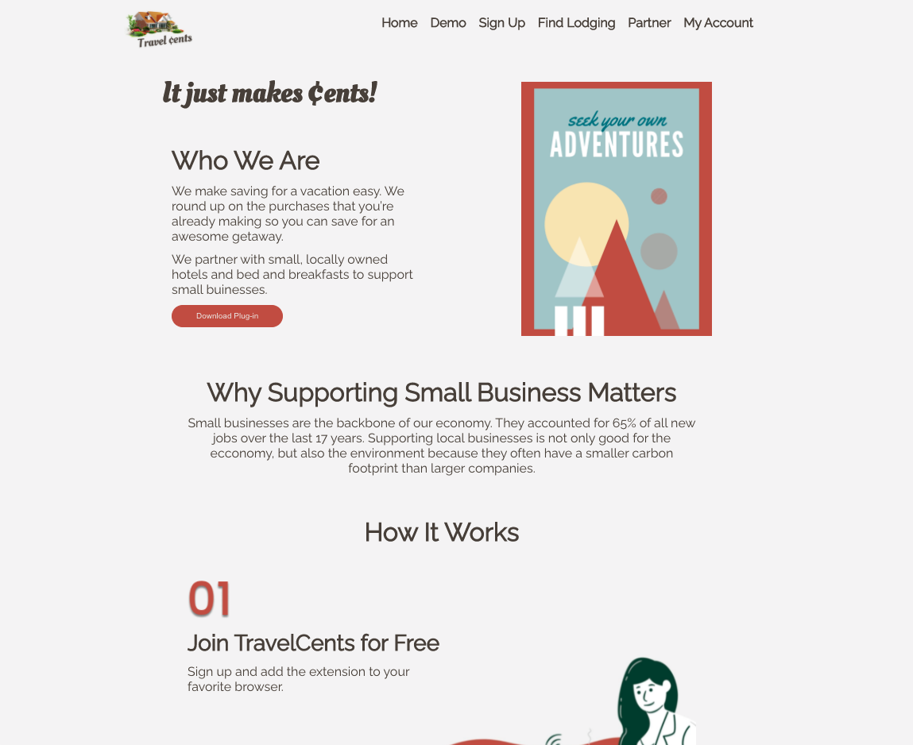

# Travel Cents

An application to encourage users to save their cents for their travel plans.

Website: https://thwcorbin.github.io/travel-cents

Repo: https://github.com/ThwCorbin/travel-cents

## Description

I participated in a Small Business Hackathon, and my cross-functional team researched, designed, and built a React front-end prototype to help small businesses in the hospitality sector. Over three days, our team (data scientist, user experience designers, and developers) came up with an idea and built a prototype that helps users save travel money to spend with small, local, hospitality businesses impacted by the pandemic. Ultimately, we wanted an application that could identify when users were on a check-out page of popular e-commerce sites. Our application would ask users if they would like to round up their cents and save it to their Travel Cents account. I focused on building the React front end, which is displayed at the links above. Our team came in 2nd in the hospitality sector! We are now working together on a seperate but related project to help struggling music venues.

## Technologies

- React
- JavaScript
- HTML
- CSS

## Installation

- Fork and clone the repo: https://github.com/ThwCorbin/travel-cents
- `git clone` + copy/paste clone inside a directory of your choice
- `cd` to the travel-cents directory
- run `npm i` in the terminal

## License

[MIT](LICENSE.txt "MIT License text file")
